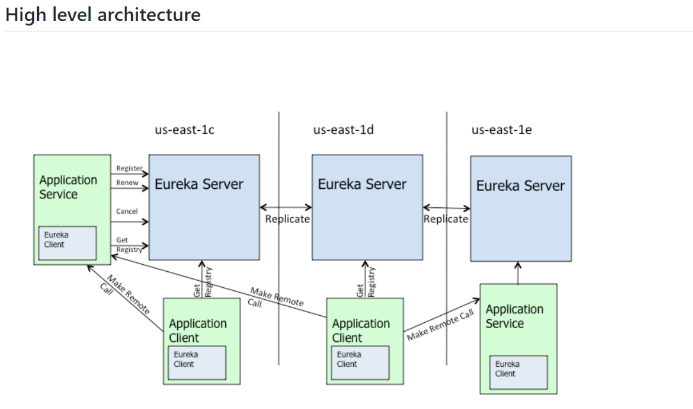

# 初识Eureka

[TOC]

----
----
## 一、什么是服务治理？
Spring Colud封装了Netflix公司开发的Eureka模块来实现服务治理

在传统的RPC远程调用框架中，管理每个服务与服务之间爱的依赖关系比较复杂，管理比较复杂，所以需要使用服务治理用于管理服务与服务之间的依赖关系，可以实现`服务调用`、`负载均衡`、`容错`等等，实现`服务发现与注册`。

## 二、什么是服务注册？
Eureka采用了CS的设计架构，Eureka Server作为服务注册功能的服务器，它是服务注册中心。而系统中的其他微服务,使用`Eureka的客户端`连接到Eureka Server并`维持心跳连接`。这样系统的维护人员就可以通过Eureka Server来监控系统中各个微服务是否正常运行。

在服务注册与发现中，有一个注册中心。 当服务器启动的时候，会把当前自己服务器的信息比如服务地址通讯地址等以别名方式注册到注册中心上。另-方（消费者|服务提供者），以该别名的方式去注册中心上获取到实际的服务通讯地址,然后再实现本地RPC调用RPC远程调用框架核心设计思想：在于注册中心，因为使用注册中心管理每个服务与服务之间的一个依赖关系（服务治理概念）。在任何rpc远程框架中，都会有-个注册中心（存放服务地址相关信息(接口地址）。  


## 三、什么是Eureka？
Eureka是基于REST（Representational State Transfer）服务、服务注册与发现的，以实现中间层服务器的负载平衡和故障转移。
                                                          
它主要包括两个组件：Eureka Server 和 Eureka Client
### 1. Eureka Client
* 一个Java客户端，用于简化与 Eureka Server 的交互（通常就是微服务中的客户端和服务端）
* Eureka是一个JAVA客户端，用于简化Eureka Server的交互，客户端同时也具备一个内置的，使用轮询（round-robin）负载算法的复杂均衡器。在应用启动后，将会向Eureka Server发送心跳（默认周期为30秒）。如果Eureka Server在多个心跳周期中没有收到某个节点的心跳，Eureka Server将会从服务注册表中把这个服务节点剔除（默认时间是90秒）。

### 2. Eureka Server
* 提供服务注册和发现的能力（通常就是微服务中的注册中心）；
* 各个微服务节点通过配置启动后，会在EurekaServer中进行注册，这样EueekaServer中的服务注册表中将会存储所有可用的服务节点的信息，服务节点的信息可以在界面直观看到。


```
The architecture above depicts how Eureka is deployed at Netflix and this is how you would typically run it. 
There is one eureka cluster per region which knows only about instances in its region. 
There is at the least one eureka server per zone to handle zone failures.

Services register with Eureka and then send heartbeats to renew their leases every 30 seconds.
If the client cannot renew the lease for a few times, it is taken out of the server registry in about 90 seconds. 
The registration information and the renewals are replicated to all the eureka nodes in the cluster. 
The clients from any zone can look up the registry information (happens every 30 seconds) to locate their services (which could be in any zone) and make remote calls.
```
官方大概意思是：

服务在Eureka上注册，然后每隔30秒发送心跳来更新它们的租约。如果客户端不能多次续订租约，那么它将在大约90秒内从服务器注册表中剔除。注册信息和更新被复制到集群中的所有eureka节点。来自任何区域的客户端都可以查找注册表信息（每30秒发生一次）来定位它们的服务（可能在任何区域）并进行远程调用。

* Eureka 客户端与服务器之间的通信
> 服务发现有两种模式：一种是客户端发现模式，一种是服务端发现模式。Eureka采用的是客户端发现模式。

* Register（注册）
> Eureka客户端将关于运行实例的信息注册到Eureka服务器。注册发生在第一次心跳。

* Renew（更新 / 续借）
> Eureka客户端需要更新最新注册信息（续借），通过每30秒发送一次心跳。更新通知是为了告诉Eureka服务器实例仍然存活。如果服务器在90秒内没有看到更新，它会将实例从注册表中删除。建议不要更改更新间隔，因为服务器使用该信息来确定客户机与服务器之间的通信是否存在广泛传播的问题。

* Fetch Registry（抓取注册信息）
> Eureka客户端从服务器获取注册表信息并在本地缓存。之后，客户端使用这些信息来查找其他服务。通过在上一个获取周期和当前获取周期之间获取增量更新，这些信息会定期更新(每30秒更新一次)。获取的时候可能返回相同的实例。Eureka客户端自动处理重复信息。

* Cancel（取消）
> Eureka客户端在关机时向Eureka服务器发送一个取消请求。这将从服务器的实例注册表中删除实例，从而有效地将实例从流量中取出。


---
## 四、Eureka自我保护模式
如果 Eureka 服务器检测到超过预期数量的注册客户端以一种不优雅的方式终止了连接，并且同时正在等待被驱逐，那么它们将进入自我保护模式。这样做是为了确保灾难性网络事件不会擦除eureka注册表数据，并将其向下传播到所有客户端。

任何客户端，如果连续3次心跳更新失败，那么它将被视为非正常终止，病句将被剔除。当超过当前注册实例15%的客户端都处于这种状态，那么自我保护将被开启。

当自我保护开启以后，eureka服务器将停止剔除所有实例，直到：
* 它看到的心跳续借的数量回到了预期的阈值之上，或者
* 自我保护被禁用

默认情况下，自我保护是启用的，并且，默认的阈值是要大于当前注册数量的15%

---
## 五、Eureka VS Zookeeper
### 1 Eureka保证AP
Eureka服务器节点之间是对等的，只要有一个节点在，就可以正常提供服务。

Eureka客户端的所有操作可能需要一段时间才能在Eureka服务器中反映出来，随后在其他Eureka客户端中反映出来。也就是说，客户端获取到的注册信息可能不是最新的，它并不保证强一致性

### 2 Zookeeper保证CP
Zookeeper集群中有一个Leader，多个Follower。Leader负责写，Follower负责读，ZK客户端连接到任何一个节点都是一样的，写操作完成以后要同步给所有Follower以后才会返回。如果Leader挂了，那么重新选出新的Leader，在此期间服务不可用。

### 3 为什么用Eureka
分布式系统大都可以归结为两个问题：数据一致性和防止单点故障。而作为注册中心的话，即使在一段时间内不一致，也不会有太大影响，所以在A和C之间选择A是比较适合该场景的。

--
## 六、Consul是什么？
Consul是一个服务网格（微服务间的 TCP/IP，负责服务之间的网络调用、限流、熔断和监控）解决方案，它是一个一个分布式的，高度可用的系统，而且开发使用都很简便。它提供了一个功能齐全的控制平面，主要特点是：服务发现、健康检查、键值存储、安全服务通信、多数据中心。

与其它分布式服务注册与发现的方案相比，Consul 的方案更“一站式”——内置了服务注册与发现框架、分布一致性协议实现、健康检查、Key/Value 存储、多数据中心方案，不再需要依赖其它工具。Consul 本身使用 go 语言开发，具有跨平台、运行高效等特点，也非常方便和 Docker 配合使用。

---
## 七、Eureka、Zookeeper、Consul三个注册中心的异同点

组件名|语言|健康检查|对外暴露接口|CAP|Spring Cloud 集成
:---:|:---:|:---:|:----:|:----:|:----:
Eureka|Java|可配支持|HTTP|AP|集成
Consul|Go|支持|HTTP/DFS|CP|集成
Zookeeper|java|支持|客户端|CP|集成